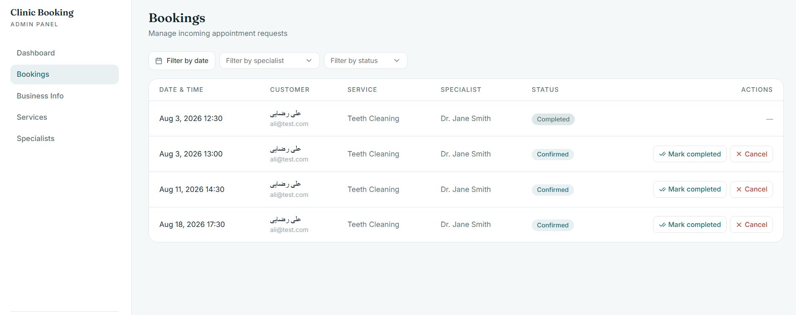
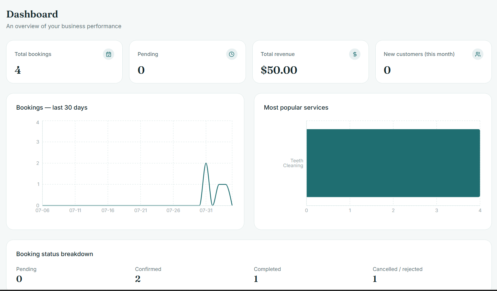

# Clinic Booking SaaS

A full-stack online booking and management platform for clinics, doctors, dentists, physiotherapists, beauty salons, and other appointment-based service businesses.

Customers can browse a business's services and specialists, check real-time availability, and book appointments online. Business owners get a complete admin panel to manage their services, specialists, working hours, bookings, and view analytics — all from one dashboard.

Built as a portfolio/demo project with production-grade architecture, designed to be extendable into a true multi-tenant SaaS product.

---

## Features

**For Customers**
- Browse businesses and their public profiles
- View services, prices, and specialists
- Real-time available time-slot calculation based on specialist working hours
- Book, track, and manage appointments
- Email confirmations and automated reminders
- Mock payment flow for confirmed bookings

**For Business Owners**
- Full CRUD for business info, services, and specialists
- Configurable weekly working hours per specialist
- Booking management with filters (date, specialist, status)
- Confirm / reject / complete / cancel bookings
- Analytics dashboard (revenue, booking trends, top services, new customers)
- Isolated, tenant-safe data — one business per owner account

**Platform**
- JWT authentication with refresh token rotation
- Role-based authorization (Customer / BusinessOwner / SuperAdmin)
- Background jobs for reminders and automatic cleanup (Hangfire)
- Abstracted payment gateway interface (swap in a real provider without touching business logic)
- Clean, layered backend architecture ready to scale into multi-tenant SaaS

---
## Screenshots

| Customer Booking Flow | Admin Dashboard |
|---|---|
|  |  |

## Tech Stack

**Backend**
- ASP.NET Core Web API (.NET 8)
- PostgreSQL + Entity Framework Core
- JWT Authentication + Refresh Tokens
- Hangfire (background jobs, PostgreSQL storage)
- MailKit (email notifications)

**Frontend**
- Next.js (App Router) + TypeScript
- shadcn/ui + Tailwind CSS
- React Hook Form + Zod
- Recharts (analytics dashboard)
- Axios

**Infrastructure**
- Docker Compose (PostgreSQL, SMTP dev server)
- Layered / Clean Architecture (Domain, Application, Infrastructure, API)

---

## Architecture
clinic-booking-saas/
├── backend/
│ └── src/
│ ├── ClinicBooking.Domain # Entities, enums — no dependencies
│ ├── ClinicBooking.Application # DTOs, service interfaces
│ ├── ClinicBooking.Infrastructure # EF Core, service implementations, external integrations
│ └── ClinicBooking.API # Controllers, JWT config, DI wiring
├── frontend/
│ ├── app/ # Next.js App Router pages
│ ├── components/ # Shared + admin UI components
│ └── lib/ # API clients, auth context, types
└── docker-compose.yml # PostgreSQL + SMTP dev server

The backend follows a layered architecture with a strict dependency rule: `Domain` has no dependencies, `Application` depends only on `Domain`, `Infrastructure` implements `Application` interfaces, and `API` wires everything together. This keeps business logic testable and independent of EF Core or ASP.NET Core specifics.

Multi-tenancy is achieved via a shared-database model where every business-scoped entity (`Service`, `Specialist`, `Booking`, `Payment`) carries a `BusinessId`, and every admin-facing endpoint validates that the authenticated owner's business matches the resource being accessed.

---

## Getting Started

### Prerequisites
- [.NET 8 SDK](https://dotnet.microsoft.com/download)
- [Node.js 20+](https://nodejs.org/)
- [Docker](https://www.docker.com/) (for PostgreSQL and the local SMTP server)

### 1. Clone the repository
```bash
git clone https://github.com/<your-username>/clinic-booking-saas.git
cd clinic-booking-saas
```

### 2. Start infrastructure services
```bash
docker compose up -d
```
This starts PostgreSQL (port `5432`) and a local SMTP test server (Web UI on `http://localhost:5000`).

### 3. Run the backend
```bash
cd backend/src/ClinicBooking.API
dotnet ef database update --project ../ClinicBooking.Infrastructure --startup-project .
dotnet run
```
The API will be available at `https://localhost:5001` (Swagger UI at `/swagger`, Hangfire dashboard at `/hangfire`).

### 4. Run the frontend
```bash
cd frontend
npm install
cp .env.example .env.local   # then fill in NEXT_PUBLIC_API_URL
npm run dev
```
The app will be available at `http://localhost:3000`.

---

## Environment Variables

**Backend** (`backend/src/ClinicBooking.API/appsettings.json`)

| Key | Description |
|---|---|
| `ConnectionStrings:DefaultConnection` | PostgreSQL connection string |
| `Jwt:Key` | Secret key for signing JWTs (use a strong secret in production) |
| `Jwt:Issuer` / `Jwt:Audience` | JWT validation values |
| `Smtp:Host` / `Smtp:Port` | SMTP server for email notifications |
| `Frontend:PaymentCallbackUrl` | URL the mock payment gateway redirects back to |

**Frontend** (`frontend/.env.local`)

| Key | Description |
|---|---|
| `NEXT_PUBLIC_API_URL` | Base URL of the backend API |

> Note: `appsettings.json` in this repo contains development-only defaults. Do not use the sample JWT key in production — see [Security Notes](#security-notes).

---

## Project Status

This project was built incrementally through defined phases:

- [x] Phase 0 — Project setup (backend layers, Next.js, Docker)
- [x] Phase 1 — Authentication & Authorization (JWT, refresh tokens, roles)
- [x] Phase 2 — Core entities (Business, Service, Specialist, Working Hours) + admin CRUD
- [x] Phase 3 — Booking engine (availability calculation, booking flow, admin booking management)
- [x] Phase 4 — Email notifications & background jobs (Hangfire)
- [x] Phase 5 — Analytics dashboard
- [x] Phase 6 — Payment integration (abstracted gateway + mock provider)
- [x] Phase 7 — Multi-tenant data isolation hardening
- [ ] Phase 8 — Testing, logging, deployment (in progress)

---

## Security Notes

- The `Jwt:Key` and database credentials in `appsettings.json` are development placeholders. In production, use environment variables, User Secrets, or a secrets manager — never commit real secrets.
- The Hangfire dashboard (`/hangfire`) is unauthenticated in development. It must be restricted before deploying (see Phase 8).
- The payment integration uses a mock gateway for demonstration. A real gateway integration requires signature verification on the callback endpoint before going live.

---

## License

This project is licensed under the MIT License — see the [LICENSE](LICENSE) file for details.